# 🎤 콘서트 예약 서비스 🎤

<details>
<summary><b>✅ 과제설명</b></summary>

- **`콘서트 예약 서비스`**를 구현해 봅니다.
- 대기열 시스템을 구축하고, 예약 서비스는 작업가능한 사용자만 수행할 수 있도록 해야합니다.
- **사용자는 좌석예약 시에 미리 충전한 잔액을 이용합니다.**
- 좌석 예약 요청시에, 결제가 이루어지지 않더라도 일정 시간동안 다른 사용자가 해당 좌석에 접근할 수 없도록 합니다.

```
항해 플러스 백엔드 과정에서 개발한 콘서트 예약 서비스입니다.
TDD와 클린 레이어드 아키텍처 구조를 기반으로 서버를 설계하고 개발했습니다.
대용량 데이터의 무결성과 성능을 보장하기 위해 동시성 제어, 트랜잭션 관리, 조회 성능 개선 방법을 배워 적용했습니다.
```

</details>

<details>
<summary><b>🤔 요구사항</b></summary>

- 아래 5가지 API 를 구현합니다.
    - 사용자 토큰 발급 API
    - 예약 가능 날짜 / 좌석 API
    - 좌석 예약 요청 API
    - 잔액 충전 / 조회 API
    - 결제 API
- 각 기능 및 제약사항에 대해 단위 테스트를 반드시 하나 이상 작성하도록 합니다.
- 다수의 인스턴스로 어플리케이션이 동작하더라도 기능에 문제가 없도록 작성하도록 합니다.
- 동시성 이슈를 고려하여 구현합니다.
- 대기열 개념을 고려해 구현합니다.

</details>

<details>
<summary><b>✏️ API Specs</b></summary>
1️⃣ **`주요` 사용자 대기열 토큰 기능**

- 서비스를 이용할 토큰을 발급받는 API를 작성합니다.
- 토큰은 사용자의 UUID 와 해당 사용자의 대기열을 관리할 수 있는 정보 ( 대기 순서 or 잔여 시간 등 ) 를 포함합니다.
- 이후 모든 API 는 위 토큰을 이용해 대기열 검증을 통과해야 이용 가능합니다.

> 기본적으로 폴링으로 본인의 대기열을 확인한다고 가정하며, 다른 방안 또한 고려해보고 구현해 볼 수 있습니다.
> 

**2️⃣ `기본` 예약 가능 날짜 / 좌석 API**

- 예약가능한 날짜와 해당 날짜의 좌석을 조회하는 API 를 각각 작성합니다.
- 예약 가능한 날짜 목록을 조회할 수 있습니다.
- 날짜 정보를 입력받아 예약가능한 좌석정보를 조회할 수 있습니다.

> 좌석 정보는 1 ~ 50 까지의 좌석번호로 관리됩니다.
> 

3️⃣ **`주요` 좌석 예약 요청 API**

- 좌석 예약과 동시에 해당 좌석은 그 사용자에게 약 5분간 임시 배정됩니다. ( 시간은 정책에 따라 자율적으로 정의합니다. )
- 날짜와 좌석 정보를 입력받아 좌석을 예약 처리하는 API 를 작성합니다.
- 만약 배정 시간 내에 결제가 완료되지 않는다면 좌석에 대한 임시 배정은 해제되어야 하며 임시배정 상태의 좌석에 대해 다른 사용자는 예약할 수 없어야 한다.

4️⃣ **`기본`**  **잔액 충전 / 조회 API**

- 결제에 사용될 금액을 API 를 통해 충전하는 API 를 작성합니다.
- 사용자 식별자 및 충전할 금액을 받아 잔액을 충전합니다.
- 사용자 식별자를 통해 해당 사용자의 잔액을 조회합니다.

5️⃣ **`주요` 결제 API**

- 결제 처리하고 결제 내역을 생성하는 API 를 작성합니다.
- 결제가 완료되면 해당 좌석의 소유권을 사용자에게 배정하고 대기열 토큰을 만료시킵니다.


#### **💡 KEY POINT**
- 사용자간 대기열을 요청 순서대로 정확하게 제공할 방법을 고민해 봅니다.
- 동시에 여러 사용자가 예약 요청을 했을 때, 좌석이 중복으로 배정 가능하지 않도록 합니다.
</details>

---

<details>
<summary><b>👥 시나리오 요구사항 분석</b></summary>

1.사용자 대기열 토큰 기능 시나리오

❓ **어떻게 대기열을 구성할 것인가** ❓
* 은행창구 방식
    * 1명이 끝나면 다음 1명이 들어오는 방식
        * 장점 : 개발자가 설정한 사용자 수만 예약이 가능, 서버 부하를 일정 수준 이하로 유지 가능
        * 단점 : 대기열에 있는 사용자는 무한정 기다릴 수 있음. 때문에 일정 시간을 주기로 사용자의 토큰을 활성화해주는 작업이 필요
* 놀이동산 방식 
    * 일정 주기마다 N 명씩 나가고 M 명씩 들어간다.
        * 장점 : 은행창구 방식과는 달리 대기시간이 있다.
        * 만약 나가는 사용자보다 들어가는 사용자가 더 많다면? -> 서버 부하 발생


2.예약 가능 날짜 & 좌석 조회 시나리오
- 사용자는 앞으로 예약 가능한 날짜를 리스트로 전체 조회
    - 이미 예약이 찬 죄석은 조회 데이터에서 제외
- 사용자가 원하는 날짜의 예약 가능한 좌석들을 조회
    - 원하는 날짜 시점부터 이후 날짜까지 남은 예약 가능한 좌석들을 조회          
- 만약 원하는 날짜에 예약 가능한 죄석이 없다면 “없다는 메시지” response

4.좌석 예약 요청 시나리오
- 사용자는 원하는 날짜의 하나의 좌석만 예약이 가능
    - 만약 중복 예약할 시 오류 메시지 response
5.잔액 충전 / 조회 시나리오
- 사용자가 잔액을 충전 (max 를 둬야할지는 일단 고민) 
- 사용자가 잔액을 조회
    - 사용자에게 발급된 토큰으로 해당 사용자임을 인증하고 -> 인증 확인 시 조회가 가능
    - 인증된 사용자가 아닐 시 조회 접근 불가     
  
6.결제 시나리오
- 잔액이 있다면 )
    - 사용자가 잔액을 조회 가능
- 잔액이 없다면 )
    - 사용자에게 “잔액이 없음” 메시지 response

</details>

<details>
<summary><b>📝 시퀀스 다이어그램</b></summary>

## 1. 대기열 발급 요청


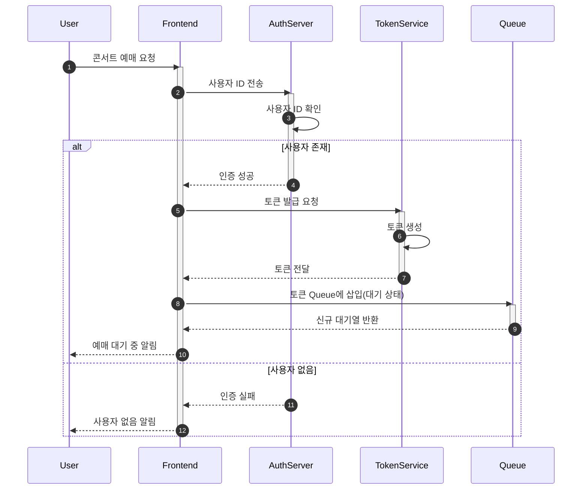

### Description
대기열 토큰 발급 요청에 대한 시퀀스 다이어그램.

1. 사용자가 대기자 목록에 들어가 위해서 우선 사용자가 존재하는지 검사합니다.
2. 사용자가 존재하지 않을 경우 에러 메시지를 반환합니다.
3. 대기열 새로 토큰 발급하여 대기열에 저장합니다. 이때, 대기열 상태는 '대기'로 저장.
4. 대기열 정보를 사용자에게 반환.


## 2. 대기열 조회 요청


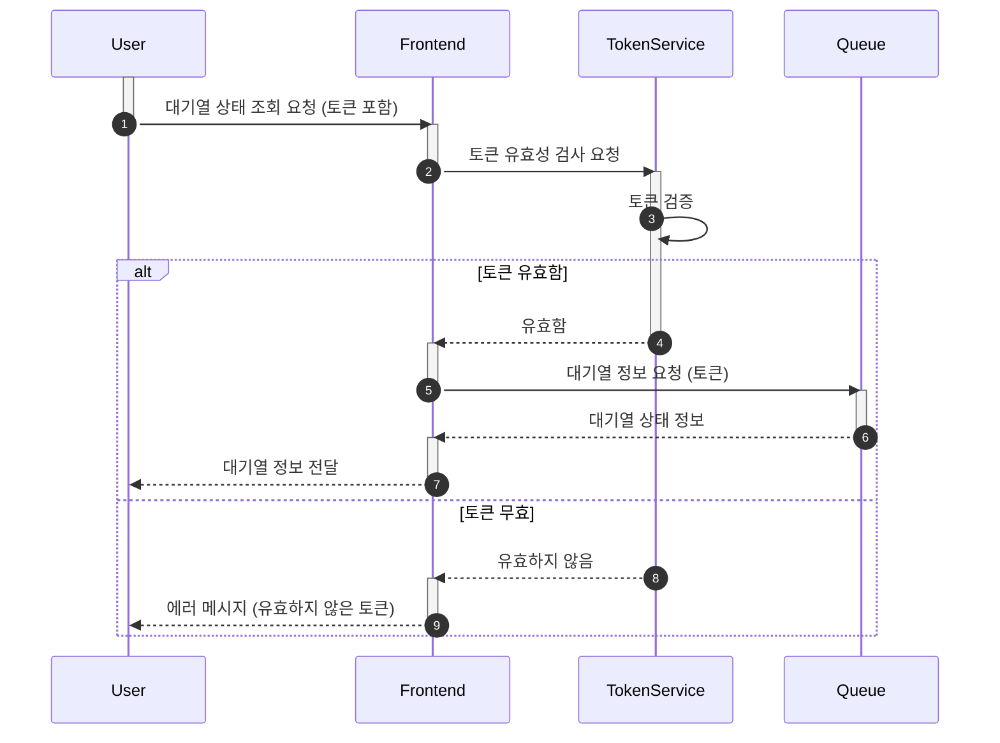

### Description
대기열 정보 조회 요청에 대한 시퀀스 다이어그램입니다.

- 사용자가 대기열 정보 조회 요청하면, 시스템은 해당 토큰이 유효한지 확인합니다.
- 토큰이 유효하지 않은 경우 에러 메시지를 반환합니다.
- 대기열 정보를 조회하여 대기 순서, 상태 등의 정보를 사용자에게 반환합니다.


## 3. 콘서트 예약 가능 회차 조회


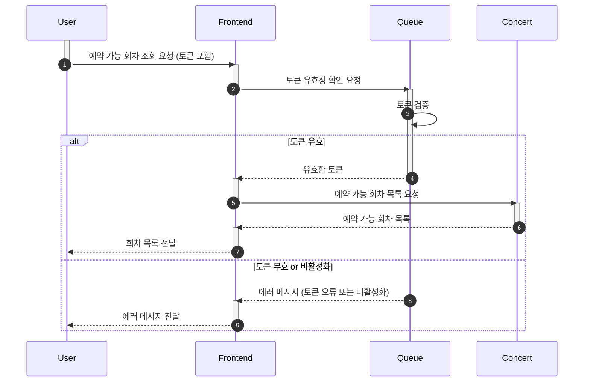

### Description
콘서트 예약 가능 날짜 조회 요청에 대한 시퀀스 다이어그램입니다.

- Queue의 역할은 명확하게 토큰을 관리하게 됩니다.
- Concert의 역할은 콘서트 예약을 관리하게 됩니다.
- 사용자가 대기열 토큰을 포함해 예약 가능한 회차를 조회 요청하면(full loop), 시스템은 해당 토큰이 유효한지 확인합니다.
- 토큰이 유효하지 않은 경우 에러 메시지를 반환합니다.
- 토큰이 활성 상태가 아닌 경우 에러 메시지를 반환합니다.
- 예약 가능한 회차 목록을 조회하여 사용자에게 반환합니다.
- 예약 가능한 회차 목록은 콘서트 일시, 잔여 좌석 수 등의 정보를 포함합니다.


## 4. 콘서트 회차 좌석 조회


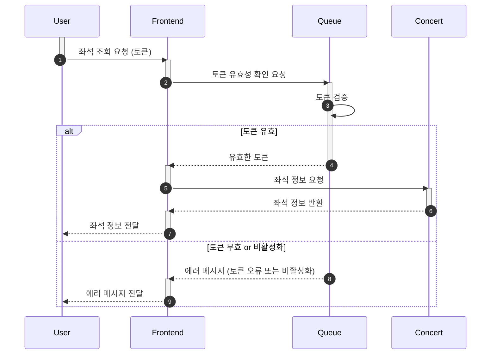

### Description
콘서트 회차의 좌석 조회 요청에 대한 시퀀스 다이어그램입니다.

- 사용자가 대기열 토큰을 포함해 특정 회차의 좌석을 조회 요청하면, 시스템은 해당 토큰이 유효한지 확인합니다.
  - 토큰이 유효하지 않은 경우 에러 메시지를 반환합니다.
  - 토큰이 활성 상태가 아닌 경우 에러 메시지를 반환합니다.
- 특정 회차의 좌석 목록을 조회하여 사용자에게 반환합니다.
- 좌석 목록은 좌석 번호, 가격, 상태 등의 정보를 포함합니다.
- 좌석 상태에는 '예약됨', '예약 가능', '판매 완료' 등으로 구분됩니다.


## 5. 콘서트 회차의 좌석 예약


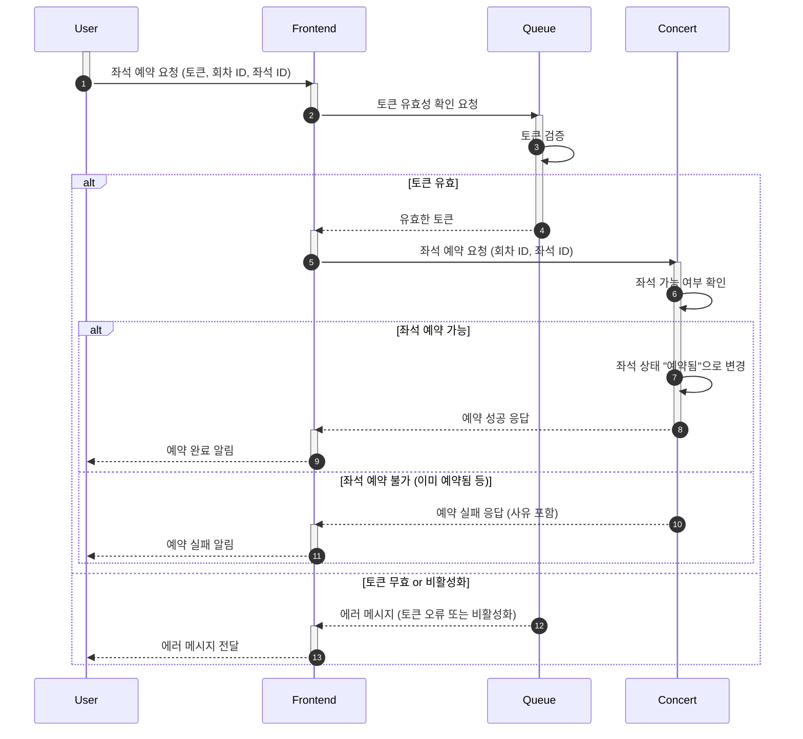

### Description
콘서트 회차의 좌석 예약 요청에 대한 시퀀스 다이어그램입니다.

- 사용자가 대기열 토큰을 포함해 특정 회차의 좌석을 예약 요청하면, 시스템은 해당 토큰이 유효한지 확인합니다.
  - 토큰이 유효하지 않은 경우 에러 메시지를 반환합니다.
  - 토큰이 활성 상태가 아닌 경우 에러 메시지를 반환합니다.
- 좌석이 이미 예약된 경우 에러 메시지를 반환합니다.
- 좌석이 예약 가능한 경우, 좌석을 임시 예약하고 사용자에게 성공 메시지를 반환합니다.
- 좌석 임시 예약은 다른 사용자가 예약할 수 없도록 잠금 처리됩니다.

## 6. 결제


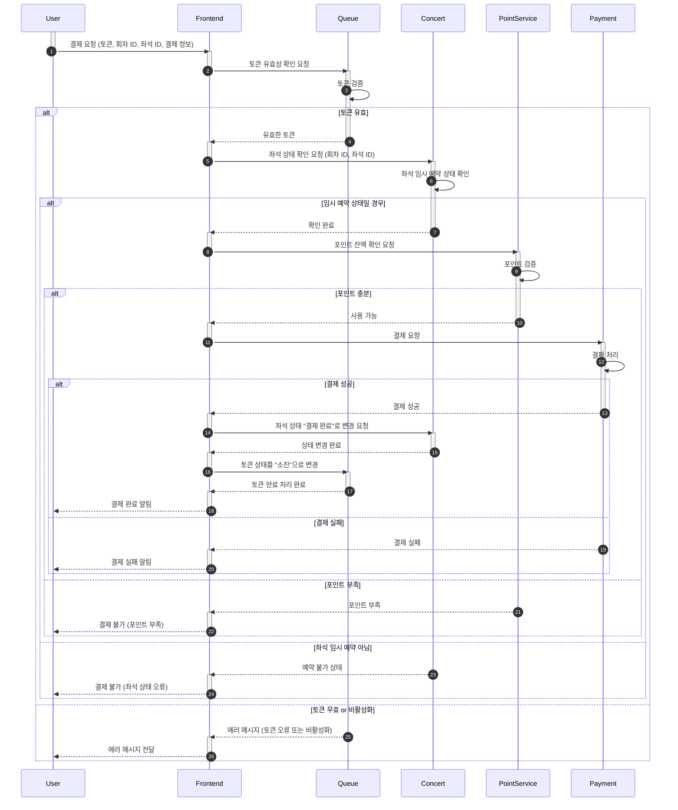

### Description
결제 요청에 대한 시퀀스 다이어그램입니다.

- 사용자가 대기열 토큰을 포함해 예약한 좌석을 결제 요청하면, 시스템은 해당 토큰이 유효한지 확인합니다.
  - 토큰이 유효하지 않은 경우 에러 메시지를 반환합니다.
- 결제 요청을 받은 시스템은 결제 진행전 마지막으로 좌성 상태를 체크합니다. 그 사이 예약 상태가 변할 수 있는 금융 행위이기 때문입니다.
- 결재 요청을 받은 시스템은 사용자의 잔액을 차감합니다.
  - 결재 요청을 잔액이 충분하지 않은 경우 에러 메시지를 반환합니다.
  - 잔액이 충분한 경우 결제 내역을 저장하고, 좌석 예약을 확정합니다.
- 결제 완료 후, 대기열 토큰을 만료 처리합니다.
- 결제 완료 정보를 사용자에게 반환합니다.

## 7. 잔액 충전


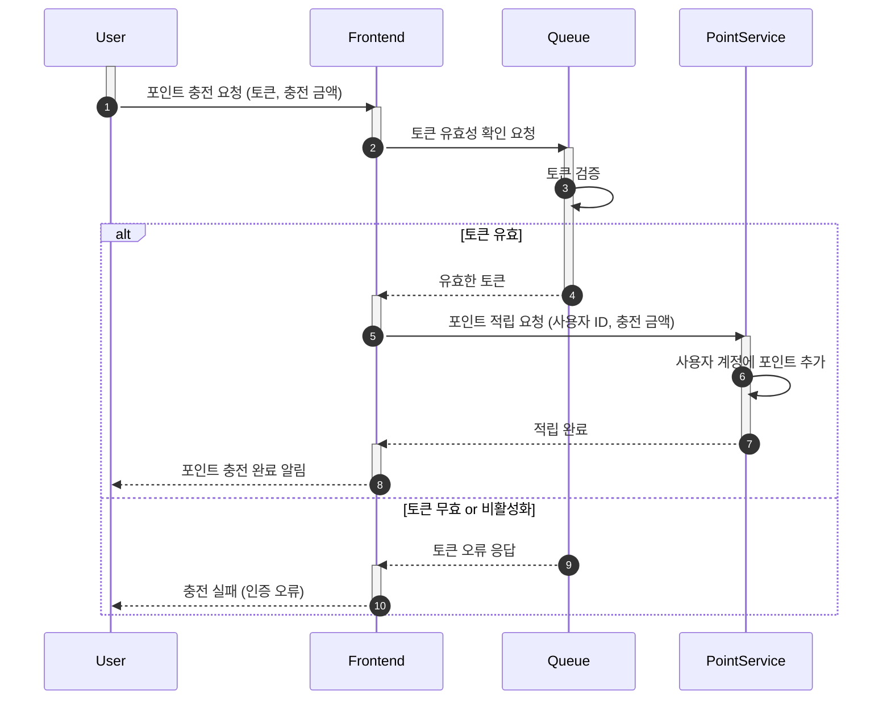

### Description
잔액 충전 요청에 대한 시퀀스 다이어그램입니다.

- 사용자 토큰이 유효한지 
- 사용자가 잔액 충전 요청을 하면, 시스템은 충전 금액이 유효한지 확인합니다.
  - 충전 금액이 유효하지 않은 경우 에러 메시지를 반환합니다.
  - 충전 금액이 유효한 경우, 사용자의 잔액을 충전하고, 총 잔액 정보를 반환합니다.

## 8. 잔액 조회


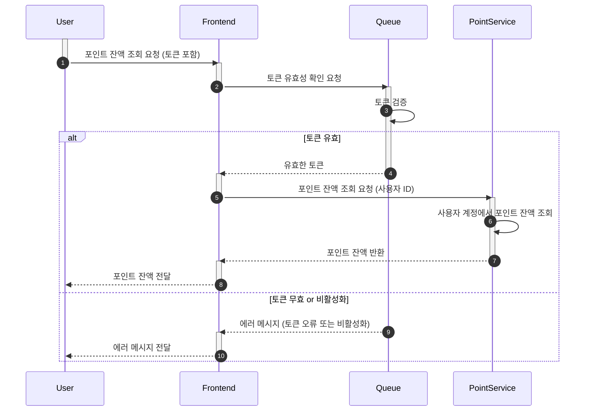
### Description
잔액 조회 요청에 대한 시퀀스 다이어그램입니다.

- 잔액조회를 위해 사용자 토큰을 우선 검증합니다.
  - 유효하지 않은 토큰이라면 에러 메시지를 반환합니다
- 사용자가 잔액 조회 요청을 하면, 시스템은 사용자의 총 잔액 정보를 반환합니다.
- 총 잔액 정보를 사용자에게 반환합니다.


## 9. 대기열 활성/만료 스케줄링

`대기열 토큰 활성`


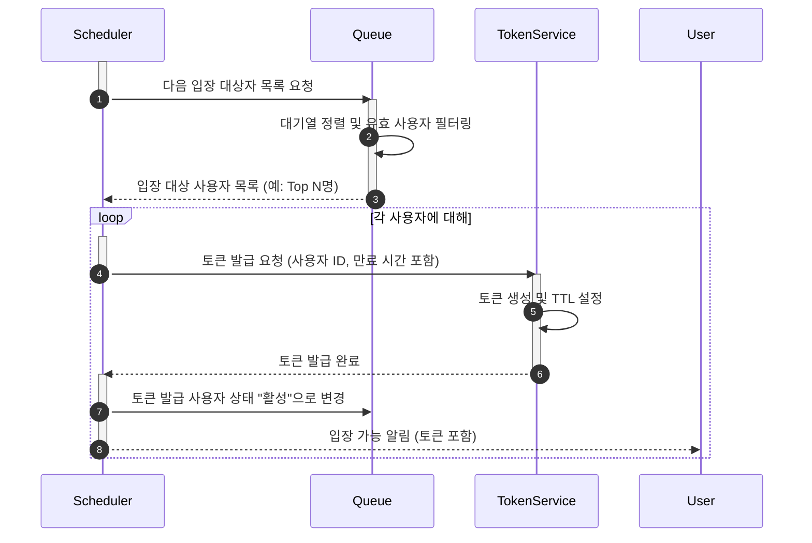

`대기열 활성 토큰 만료`


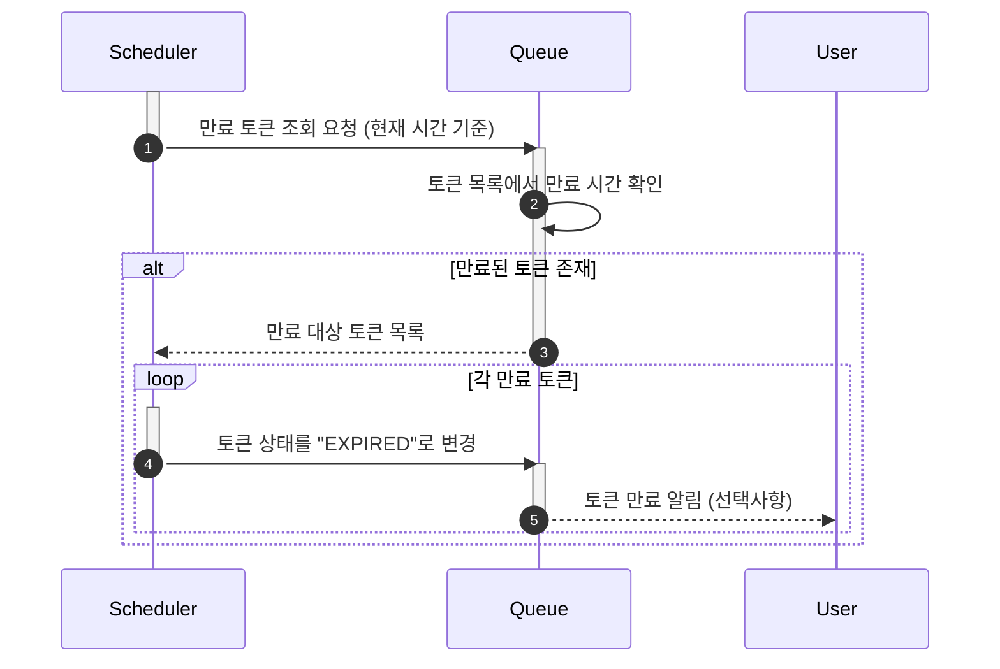

### Description
대기열 토큰 활성/만료 스케줄링에 대한 시퀀스 다이어그램입니다.

- `대기열 토큰 활성`
  - 일정 시간마다 대기 중인 대기열 N 개를 활성 상태로 변경합니다.
- `대기열 활성 토큰 만료`
  - 일정 시간마다 활성 토큰을 만료 처리합니다.
  - 만료시킬 기준은 활성 일시를 기준으로 합니다.
  - 활성 일시가 N분 이상 지난 토큰은 만료 처리합니다.
  - 마지막 액션 시간이 N분 이상 지난 활성 토큰은 만료 처리합니다.


## 10. 임시 예약 좌석 만료 스케줄링

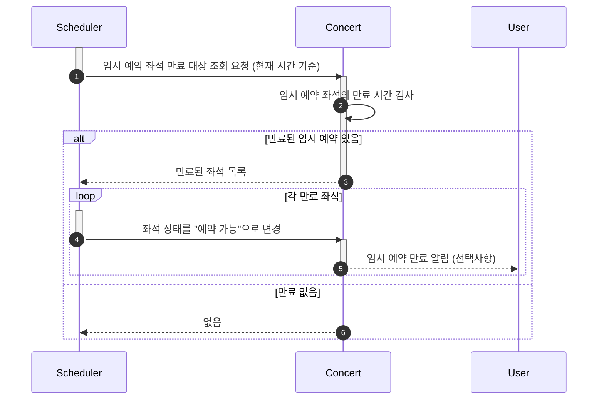

### Description
임시 예약 좌석 만료 스케줄링에 대한 시퀀스 다이어그램입니다.

일정 시간마다 임시 예약된 좌석을 만료 처리합니다.
만료 조건은 5분동안 결제가 완료되지 않은 경우입니다.
결제 일시 기준으로 5분이 지난 임시 예약 좌석은 만료 처리합니다.

</details>

<details>
<summary><b>📝 ERD 다이어그램</b></summary>

### 3. [ERD]()
</details>

#### Running Docker Containers

`local` profile 로 실행하기 위하여 인프라가 설정되어 있는 Docker 컨테이너를 실행해주셔야 합니다.

```bash
docker-compose up -d
```
