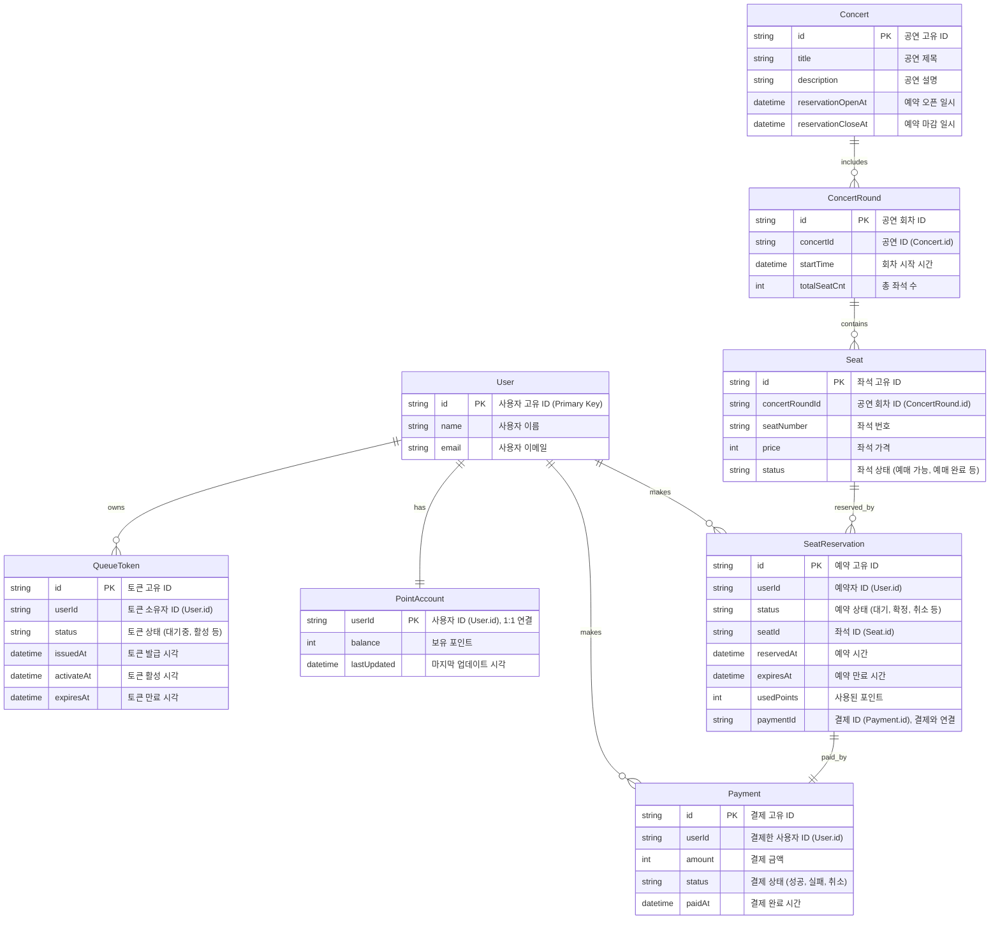

<Description>

### 다수의 좌석을 예약을 뺀 이유
우선은 1:1 맵핑으로 기능을 구현하고
추후에 1:N의 좌석을 예약할 수 있도록 하고자 함. 수정한다면 SeatReservation의 seatId를 복수로 만들고자 함

### pk에 string을 쓴 이유
- UUID 또는 고유 문자열 ID 사용 전제
- 분산 시스템에서 중복 방지
- 프론트와 백엔드 통신 시 일관성 유지

### userId와 PointAccount 관계
완벽한 1:1 관계로 만들기 위해 PointAccount에는 userId를 PK로 넣음

### QueueToken
대기열이 하나뿐이기 때문에 Token의 Id를 PK로 사용

</Description>